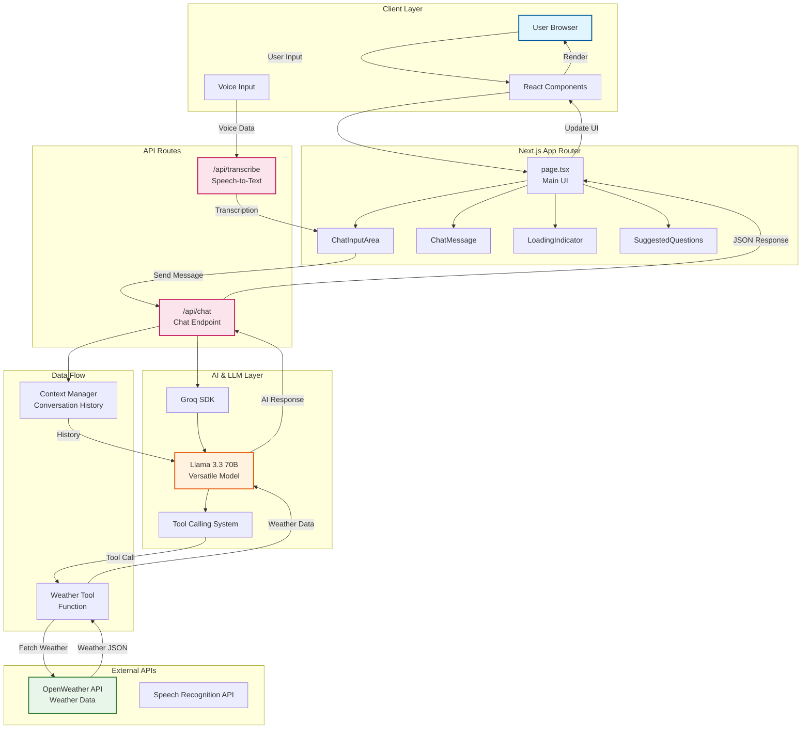
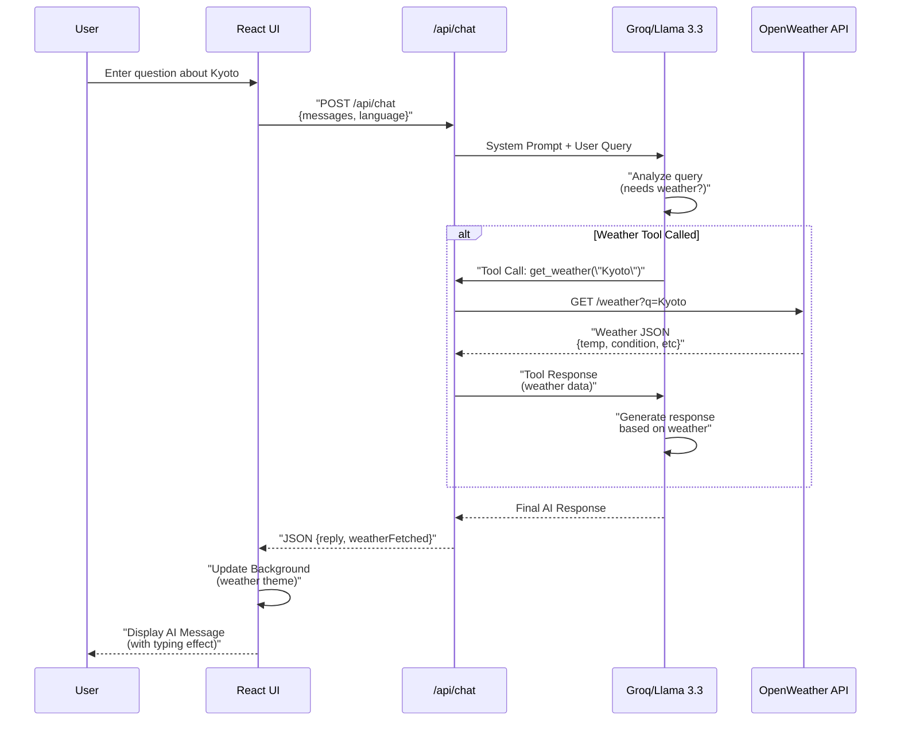
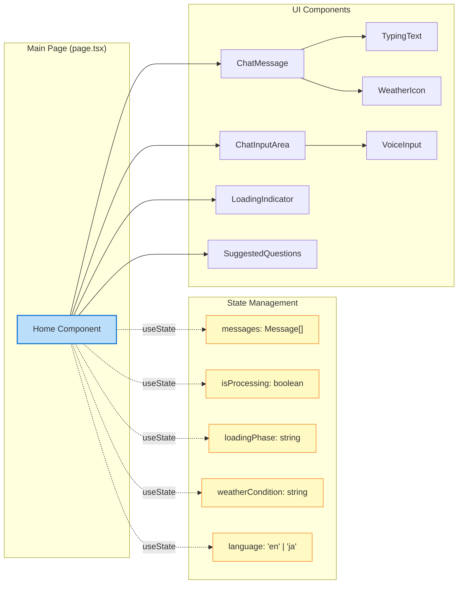

# 🛫 Jini - AI Travel Assistant for Japan

---

## 📖 日本語

### 概要

**Jini**は、日本旅行に特化したAI搭載のトラベルアシスタントアプリケーションです。リアルタイムの天気情報を取得し、天候に応じた旅行プランや観光地の提案を行います。日本語と英語の両方に対応しており、美しいUIと直感的なユーザー体験を提供します。

### 主な機能

- 🤖 **AI会話エージェント**: Llama 3.3 70Bモデルを使用した高度な対話型AI
- 🌤️ **リアルタイム天気情報**: OpenWeather APIと連携し、最新の天気データを取得
- 🎨 **動的UIテーマ**: 天候に応じて背景が自動的に変化
- 🗣️ **音声入力対応**: ハンズフリーで質問できる音声入力機能
- 🌐 **多言語対応**: 日本語・英語の切り替えが可能
- 💬 **コンテキスト保持**: 会話履歴を記憶し、自然な対話を実現
- 📱 **レスポンシブデザイン**: デスクトップ・モバイルの両方に最適化
- ✨ **モダンなアニメーション**: Framer Motionによる滑らかなトランジション

### 技術スタック

- **フレームワーク**: Next.js 16 (App Router)
- **言語**: TypeScript 5
- **UI**: React 19
- **スタイリング**: Tailwind CSS 4
- **アニメーション**: Framer Motion
- **AI/LLM**: Groq SDK (Llama 3.3 70B Versatile)
- **外部API**: OpenWeather API
- **アイコン**: Lucide React
- **HTTPクライアント**: Axios

### システム要件

- Node.js 20以上
- npm / yarn / pnpm / bun
- Groq APIキー
- OpenWeather APIキー

### セットアップ手順

1. **リポジトリのクローン**

```bash
git clone <repository-url>
cd travel-bot
```

2. **依存関係のインストール**

```bash
npm install
# または
yarn install
```

3. **環境変数の設定**

プロジェクトルートに `.env.local` ファイルを作成し、以下の環境変数を設定してください：

```env
GROQ_API_KEY=your_groq_api_key_here
OPENWEATHER_API_KEY=your_openweather_api_key_here
```

4. **開発サーバーの起動**

```bash
npm run dev
```

5. **ブラウザでアクセス**

[http://localhost:3000](http://localhost:3000) を開いてアプリケーションを確認してください。

### 使用方法

1. アプリケーションを開くと、AIアシスタントが挨拶します
2. テキストまたは音声で質問を入力してください
3. 言語切り替えボタン（右上）で日本語/英語を切り替え可能
4. 天気やおすすめの観光地について質問すると、AIが天気情報を取得して最適な提案をします

**質問例：**
- 「京都の天気はどうですか？」
- 「大阪でおすすめの観光スポットを教えてください」
- 「東京で雨の日に行ける場所は？」

### プロジェクト構造

```
travel-bot/
├── app/
│   ├── api/
│   │   ├── chat/          # チャットAPIエンドポイント
│   │   │   └── route.ts   # LLMとの対話処理
│   │   └── transcribe/    # 音声文字起こしAPI
│   │       └── route.ts
│   ├── components/        # Reactコンポーネント
│   │   ├── ChatInputArea.tsx      # 入力エリア
│   │   ├── ChatMessage.tsx        # メッセージ表示
│   │   ├── LoadingIndicator.tsx   # ローディング状態
│   │   ├── SuggestedQuestions.tsx # 質問候補表示
│   │   ├── TypingText.tsx         # タイピング効果
│   │   ├── VoiceInput.tsx         # 音声入力
│   │   └── WeatherIcon.tsx        # 天気アイコン
│   ├── globals.css        # グローバルスタイル
│   ├── layout.tsx         # ルートレイアウト
│   └── page.tsx          # メインページ
├── public/               # 静的ファイル
├── package.json
└── tsconfig.json
```

### ビルドとデプロイ

**本番ビルド:**

```bash
npm run build
npm run start
```

**Vercelへのデプロイ:**

このプロジェクトはVercelへの簡単なデプロイに対応しています。環境変数を設定することを忘れないでください。

```bash
vercel
```

### ライセンス

MIT License

---

## 📖 English

### Overview

**Jini** is an AI-powered travel assistant application specialized for Japan travel. It fetches real-time weather information and provides travel plans and sightseeing recommendations based on current weather conditions. The app supports both Japanese and English, offering a beautiful UI and intuitive user experience.

### Key Features

- 🤖 **AI Conversational Agent**: Advanced conversational AI using Llama 3.3 70B model
- 🌤️ **Real-time Weather Information**: Integrated with OpenWeather API for current weather data
- 🎨 **Dynamic UI Themes**: Background automatically changes based on weather conditions
- 🗣️ **Voice Input Support**: Hands-free voice input functionality
- 🌐 **Multi-language Support**: Switch between Japanese and English
- 💬 **Context Retention**: Remembers conversation history for natural dialogue
- 📱 **Responsive Design**: Optimized for both desktop and mobile
- ✨ **Modern Animations**: Smooth transitions powered by Framer Motion

### Tech Stack

- **Framework**: Next.js 16 (App Router)
- **Language**: TypeScript 5
- **UI**: React 19
- **Styling**: Tailwind CSS 4
- **Animation**: Framer Motion
- **AI/LLM**: Groq SDK (Llama 3.3 70B Versatile)
- **External API**: OpenWeather API
- **Icons**: Lucide React
- **HTTP Client**: Axios

### System Requirements

- Node.js 20 or higher
- npm / yarn / pnpm / bun
- Groq API Key
- OpenWeather API Key

### Setup Instructions

1. **Clone the repository**

```bash
git clone <repository-url>
cd travel-bot
```

2. **Install dependencies**

```bash
npm install
# or
yarn install
```

3. **Configure environment variables**

Create a `.env.local` file in the project root and set the following environment variables:

```env
GROQ_API_KEY=your_groq_api_key_here
OPENWEATHER_API_KEY=your_openweather_api_key_here
```

4. **Start the development server**

```bash
npm run dev
```

5. **Open in browser**

Navigate to [http://localhost:3000](http://localhost:3000) to view the application.

### Usage

1. When you open the application, the AI assistant will greet you
2. Enter your question via text or voice input
3. Use the language toggle button (top right) to switch between Japanese/English
4. Ask about weather or recommended tourist spots, and the AI will fetch weather data to provide optimal suggestions

**Example Questions:**
- "How is the weather in Kyoto?"
- "What are some recommended tourist spots in Osaka?"
- "Where can I go in Tokyo on a rainy day?"

### Project Structure

```
travel-bot/
├── app/
│   ├── api/
│   │   ├── chat/          # Chat API endpoint
│   │   │   └── route.ts   # LLM interaction logic
│   │   └── transcribe/    # Speech-to-text API
│   │       └── route.ts
│   ├── components/        # React components
│   │   ├── ChatInputArea.tsx      # Input area
│   │   ├── ChatMessage.tsx        # Message display
│   │   ├── LoadingIndicator.tsx   # Loading states
│   │   ├── SuggestedQuestions.tsx # Suggested questions
│   │   ├── TypingText.tsx         # Typing effect
│   │   ├── VoiceInput.tsx         # Voice input
│   │   └── WeatherIcon.tsx        # Weather icon
│   ├── globals.css        # Global styles
│   ├── layout.tsx         # Root layout
│   └── page.tsx          # Main page
├── public/               # Static files
├── package.json
└── tsconfig.json
```

### Build and Deploy

**Production build:**

```bash
npm run build
npm run start
```

**Deploy to Vercel:**

This project is ready for easy deployment to Vercel. Don't forget to set up your environment variables.

```bash
vercel
```

### License

MIT License

---

## 🏗️ System Architecture



## 📊 Data Flow Diagram



## 🎨 Component Architecture



---

## 👨‍💻 Development

### Available Scripts

- `npm run dev` - Start development server
- `npm run build` - Build for production
- `npm run start` - Start production server
- `npm run lint` - Run ESLint

### Environment Variables

| Variable | Description | Required |
|----------|-------------|----------|
| `GROQ_API_KEY` | API key for Groq (Llama 3.3) | Yes |
| `OPENWEATHER_API_KEY` | API key for OpenWeather | Yes |

### API Endpoints

**POST /api/chat**
- Request: `{ messages: Message[], language: 'English' | 'Japanese' }`
- Response: `{ reply: string, weatherFetched: boolean, weather?: object }`

**POST /api/transcribe** (if implemented)
- Request: Audio data
- Response: Transcribed text

---

## 🤝 Contributing

Contributions are welcome! Please feel free to submit a Pull Request.

## 📧 Contact

For questions or feedback, please open an issue on GitHub.

---

**Made with ❤️ for Japan travelers**
